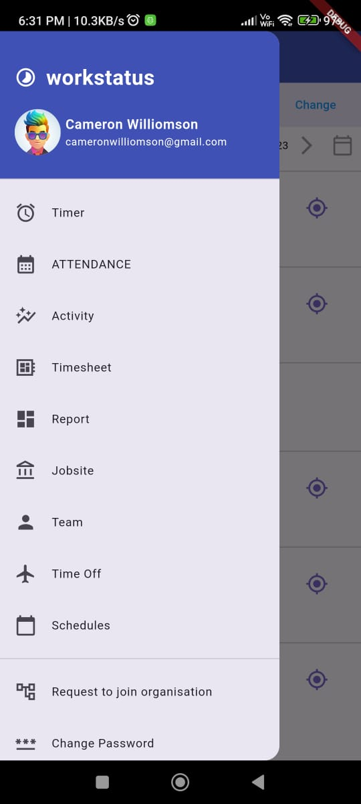

# vinove_assignemnt

Assignment for Vinove Company

## Getting Started

Need to develop Location screen within Flutter framework:
1) From Menu, click on Attendance - it will load a list of members with 2 icons on the
right side. The 2nd icon is to check the current Location & Route traveled by an
individual member.

3) When you see any individual member data (by clicking on the icon), it will show the
current location on MAP. And in bottom - it shows all the visited locations in timeline
view. By default, it shows TODAY's data - date filter will help to see past dates data. You
can pull the list above to see the complete list of traveled locations.

5) Any 2 visited locations will generate a route which can be seen on the next screen. It
shows Start Location, Stop Location, Total KMs & Total Duration traveled. On the
bottom (map screen), it shows the complete route drawn on Google Map. The red dots
on the route line shows STOP time (so if a user has stopped for more than 10 min
anywhere while traveling, it will count as STOP time).

